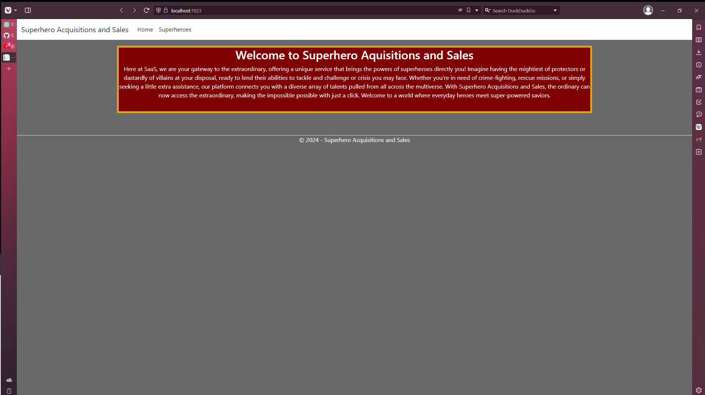
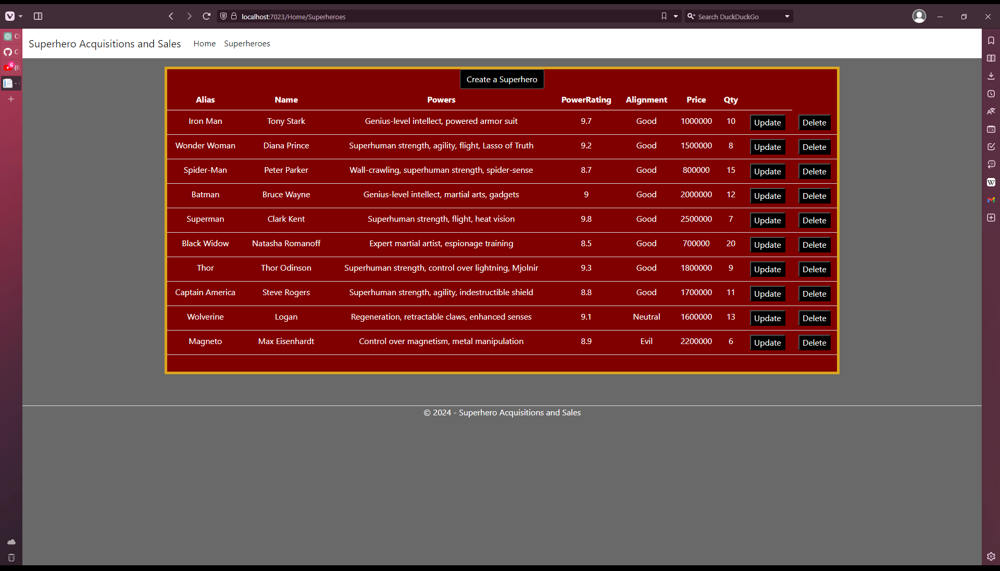
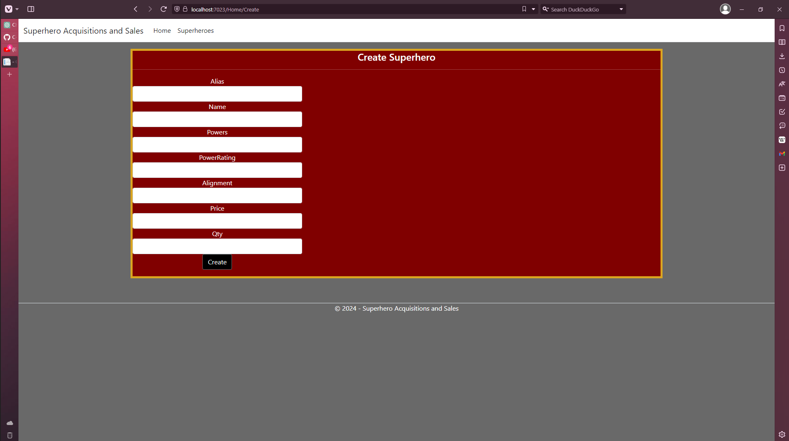

# C# CRUD Application


This repository contains a simple C# CRUD (Create, Read, Update, Delete) application built using the MVC pattern.

## Table of Contents

- [Features](#features)
- [Technologies Used](#technologies-used)
- [Setup](#setup)
- [Usage](#usage)
- [Endpoints](#endpoints)
- [Screenshots](#screenshots)

## Features

- **CRUD Operations:** Perform Create, Read, Update, and Delete operations on data.
- **MVC Architecture:** Follows the Model-View-Controller pattern for organizing code and separating concerns.
- **C#:** Developed using the C# programming language.
- **ASP.NET Core MVC:** Utilizes ASP.NET Core MVC for building web applications.

## Technologies Used

- C#
- ASP.NET Core MVC
- MySQL
- Visual Studio (or Visual Studio Code)

## Setup

1. **Clone the repository:**

    ```bash
    git clone https://github.com/danthalomous/C-Sharp_CRUD_Application.git
    ```

2. **Navigate to the project directory:**

    ```bash
    cd CST-323-Milestone-Project
    ```

3. **Configure the database:**

    - Create a SQL Server database (or use an existing one).
    - Update the database connection string in `appsettings.json`.

4. **Open the project in Visual Studio (or Visual Studio Code).**

5. **Build and run the application:**

    - Press F5 or use the "Start" button in Visual Studio to build and run the application.

## Usage

Once the application is up and running, you can interact with it through its web interface.

## Endpoints

- **GET /Home/Superheroes:** Retrieve all entities.
- **POST /Home/Superheroes/CreateSuperhero:** Create a new entity.
- **POST /Home/Superheroes/UpdateSuperhero/{superHero):** Update an entity by model (which has the ID).
- **POST /Home/Superheroes/DeleteSuperhero/{superHero}:** Delete an entity by model (which has the ID).

## Screenshots

- Below is a screenshot of the home page:
  

- Here is what the /Home/Superheroes GET looks like (all the entries in the database):
  

- Here is what the /Home/Superheroes/CreateUpdate form page looks like (the update form is almost identical to this):
  
